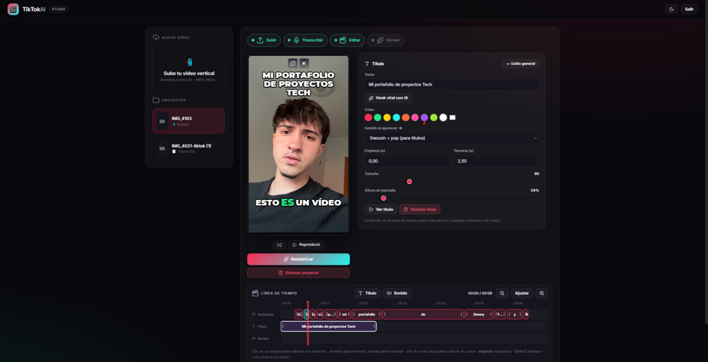

# 🎬 TikTokAI — Editor de subtítulos karaoke con IA

Sube un vídeo vertical, genera **subtítulos karaoke palabra a palabra** sincronizados con tu voz, retócalos en un editor con timeline estilo CapCut y descarga el vídeo final listo para publicar en TikTok.



## Qué hace

1. **Subir** un vídeo vertical (MP4/MOV…).
2. **Transcribir** con Whisper large-v3 (vía Groq): cada palabra con su timestamp exacto.
3. **Editar**: corrige palabras, ajusta el estilo (fuente, tamaño, colores, posición, palabras por bloque, "pop" de la palabra activa), añade títulos y efectos de sonido en un timeline multipista con imantado y deshacer.
4. **Copy con IA**: genera título viral y hashtags basados en lo que realmente se dice en el vídeo.
5. **Renderizar**: ffmpeg + libass queman los subtítulos y títulos sobre el vídeo.
6. **Descargar** el resultado final.

Cada paso se puede re-ejecutar de forma independiente desde la interfaz.

## Arquitectura

```
static/ (UI: HTML+CSS+JS, sin build)  ──►  FastAPI (app/main.py)
                                              ├── jobs.py        cola de 1 worker (serializa CPU)
                                              ├── media.py       ffprobe + extracción de audio
                                              ├── transcribe.py  Groq Whisper (word-level)
                                              ├── subtitles.py   genera .ass karaoke + auto-wrap
                                              ├── render.py      ffmpeg burn-in
                                              └── captions.py    Groq chat (copy + hashtags)
data/projects/<id>/   project.json + source.* + audio.mp3 + subs.ass + output.mp4
```

La transcripción y el copy corren en la nube (Groq), así que no necesitas GPU: el único trabajo local es el render con ffmpeg.

## Requisitos

- Python 3.10+
- **ffmpeg** compilado con **libass** (`ffmpeg -filters | grep ass` para comprobarlo)
- Una API key gratuita de [Groq](https://console.groq.com/keys)

## Instalación

```bash
git clone https://github.com/danitechIA/TIKTOKAI.git
cd TIKTOKAI
python3 -m venv .venv
source .venv/bin/activate        # En Windows: .venv\Scripts\activate
pip install -r requirements.txt
cp .env.example .env             # y pon tu GROQ_API_KEY
```

## Arrancar

```bash
uvicorn app.main:app --host 127.0.0.1 --port 8080
```

Abre `http://localhost:8080`. Si defines `APP_PASSWORD` en el `.env`, la interfaz pedirá esa contraseña (útil si lo despliegas en un servidor); déjalo vacío para uso local sin login.

## Notas de despliegue

En producción corre bien en un VPS modesto sin GPU: la cola procesa un render cada vez y ffmpeg puede ejecutarse con prioridad reducida (`nice`/`ionice`) para convivir con otros servicios en la misma máquina.
